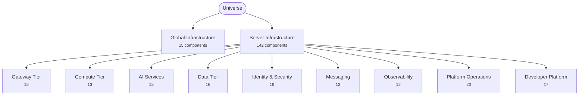
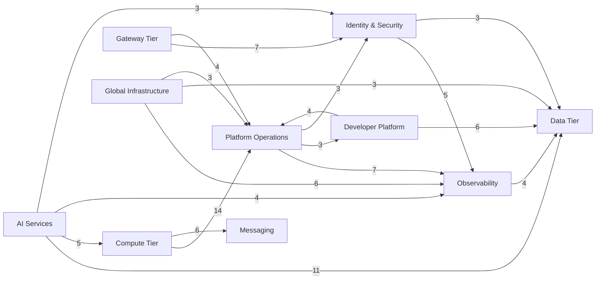

<!-- Generated by architecture/scaffold.py from architecture/universe.yaml. Do not edit by hand. -->

# Universe

Top of the platform hierarchy. Everything Helion Nova runs — globally distributed infrastructure and the server tiers inside each region.

**168 nodes · 157 components · 2 top-level domains.**

Source of truth: [`universe.yaml`](./universe.yaml). Regenerate this file and
the [`universe/`](./universe/) tree with `python3 architecture/scaffold.py`.

## Status

| Status | Components | Share |
| --- | --- | --- |
| ○ Planned | 157 | 100% |
| ◐ Building | 0 | 0% |
| ● Running | 0 | 0% |

A component having a directory does not mean it is running — this tree is a
map, not an inventory.

## Map

Tier level only; the [tree](#tree) below goes to full depth.



## Contents

- [Global Infrastructure](#global-infrastructure) — 15 components
- [Server Infrastructure](#server-infrastructure) — 142 components
  - [Gateway Tier](#gateway-tier) — 15 components
  - [Compute Tier](#compute-tier) — 13 components
  - [AI Services](#ai-services) — 18 components
  - [Data Tier](#data-tier) — 16 components
  - [Identity & Security](#identity-and-security) — 19 components
  - [Messaging](#messaging) — 12 components
  - [Observability](#observability) — 12 components
  - [Platform Operations](#platform-operations) — 20 components
  - [Developer Platform](#developer-platform) — 17 components

## Tree

```
Universe/
│
├── Global Infrastructure/
│   ├── Global Control Plane
│   ├── Multi-Cloud Manager
│   ├── Multi-Region Manager
│   ├── Multi-Tenant Manager
│   ├── Global DNS
│   ├── CDN
│   ├── Traffic Director
│   ├── Global Load Balancer
│   ├── Disaster Recovery Controller
│   ├── Edge Fabric
│   ├── Region Manager
│   ├── Zone Manager
│   ├── Capacity Planner
│   ├── Cost Optimizer
│   └── Infrastructure Telemetry
│
└── Server Infrastructure/
    │
    ├── Gateway Tier/
    │   ├── API Gateway
    │   ├── Reverse Proxy
    │   ├── GraphQL Gateway
    │   ├── REST Gateway
    │   ├── gRPC Gateway
    │   ├── WebSocket Gateway
    │   ├── HTTP/3 Gateway
    │   ├── QUIC Gateway
    │   ├── TLS Terminator
    │   ├── API Firewall
    │   ├── Request Router
    │   ├── Rate Limiter
    │   ├── DDoS Protection
    │   ├── API Version Manager
    │   └── Edge Gateway
    │
    ├── Compute Tier/
    │   ├── API Cluster
    │   ├── AI Cluster
    │   ├── Batch Cluster
    │   ├── Streaming Cluster
    │   ├── GPU Cluster
    │   ├── CPU Cluster
    │   ├── Worker Cluster
    │   ├── Background Services
    │   ├── Microservice Runtime
    │   ├── Serverless Runtime
    │   ├── Edge Runtime
    │   ├── HPC Cluster
    │   └── Compute Scheduler
    │
    ├── AI Services/
    │   ├── Inference
    │   ├── Model Registry
    │   ├── Model Versioning
    │   ├── Model Deployment
    │   ├── Embeddings
    │   ├── RAG
    │   ├── Knowledge Service
    │   ├── Vector Search
    │   ├── Agent Runtime
    │   ├── Vision
    │   ├── Speech
    │   ├── OCR
    │   ├── Model Cache
    │   ├── Dataset Manager
    │   ├── Experiment Tracking
    │   ├── Training Pipeline
    │   ├── Evaluation
    │   └── Model Monitoring
    │
    ├── Data Tier/
    │   ├── SQL Cluster
    │   ├── NoSQL Cluster
    │   ├── Graph Database
    │   ├── Time-Series Database
    │   ├── Vector Database
    │   ├── Search Engine
    │   ├── Object Storage
    │   ├── Blob Storage
    │   ├── File Storage
    │   ├── Cache Cluster
    │   ├── Data Lake
    │   ├── Data Warehouse
    │   ├── ETL Platform
    │   ├── Backup Manager
    │   ├── Replication Manager
    │   └── Archive Manager
    │
    ├── Identity & Security/
    │   ├── Identity Provider
    │   ├── OAuth
    │   ├── OpenID Connect
    │   ├── MFA
    │   ├── Session Store
    │   ├── Token Service
    │   ├── Authorization
    │   ├── Policy Engine
    │   ├── PKI
    │   ├── Certificate Authority
    │   ├── Key Management
    │   ├── Secret Vault
    │   ├── Security Monitoring
    │   ├── Threat Detection
    │   ├── SIEM
    │   ├── Vulnerability Scanner
    │   ├── Compliance
    │   ├── Audit Pipeline
    │   └── Security Operations
    │
    ├── Messaging/
    │   ├── Event Bus
    │   ├── Message Queue
    │   ├── Job Queue
    │   ├── Kafka Cluster
    │   ├── MQTT Broker
    │   ├── Redis Streams
    │   ├── Pub/Sub
    │   ├── Notification Hub
    │   ├── Email Service
    │   ├── SMS Service
    │   ├── Push Notifications
    │   └── Webhook Dispatcher
    │
    ├── Observability/
    │   ├── Metrics
    │   ├── Logging
    │   ├── Distributed Tracing
    │   ├── Dashboards
    │   ├── Alerting
    │   ├── Incident Manager
    │   ├── Error Tracking
    │   ├── Performance Analytics
    │   ├── Capacity Analytics
    │   ├── Cost Analytics
    │   ├── Health Monitoring
    │   └── Uptime Monitoring
    │
    ├── Platform Operations/
    │   ├── Kubernetes
    │   ├── Container Runtime
    │   ├── Service Mesh
    │   ├── Load Balancer
    │   ├── Autoscaler
    │   ├── Node Manager
    │   ├── Cluster Scheduler
    │   ├── Service Discovery
    │   ├── Service Registry
    │   ├── Rolling Deployments
    │   ├── Blue/Green Deployments
    │   ├── Canary Deployments
    │   ├── Rollback Manager
    │   ├── Failover Manager
    │   ├── Update Service
    │   ├── Infrastructure as Code
    │   ├── Configuration Management
    │   ├── Secret Distribution
    │   ├── Fleet Manager
    │   └── Resource Optimizer
    │
    └── Developer Platform/
        ├── CI
        ├── CD
        ├── Build Farm
        ├── Artifact Repository
        ├── Package Registry
        ├── SDK Registry
        ├── Plugin Marketplace
        ├── Documentation Portal
        ├── Symbol Server
        ├── Benchmark Platform
        ├── Test Infrastructure
        ├── Release Manager
        ├── API Explorer
        ├── Developer Portal
        ├── Template Generator
        ├── Internal Package Manager
        └── License Service
```

## Global Infrastructure

Cross-region, cross-cloud, cross-tenant control. Decides where capacity lives and where traffic goes; the tiers below execute within that frame.

**Owner:** `infra-global` · **15 components** (15 planned)

| Component | Status | Purpose |
| --- | --- | --- |
| [Global Control Plane](./universe/global-infrastructure/global-control-plane/) | ○ Planned | Single authoritative control surface for every region, cloud, and tenant in the fleet. |
| [Multi-Cloud Manager](./universe/global-infrastructure/multi-cloud-manager/) | ○ Planned | Normalizes provisioning and policy across cloud providers and bare metal. |
| [Multi-Region Manager](./universe/global-infrastructure/multi-region-manager/) | ○ Planned | Owns region topology, placement rules, and cross-region promotion. |
| [Multi-Tenant Manager](./universe/global-infrastructure/multi-tenant-manager/) | ○ Planned | Tenant isolation boundaries, quotas, and per-tenant configuration. |
| [Global DNS](./universe/global-infrastructure/global-dns/) | ○ Planned | Authoritative DNS with health-aware records and geographic routing. |
| [CDN](./universe/global-infrastructure/cdn/) | ○ Planned | Edge distribution of static and cacheable-dynamic responses, with purge control. |
| [Traffic Director](./universe/global-infrastructure/traffic-director/) | ○ Planned | Policy-driven steering of traffic across regions and service versions. |
| [Global Load Balancer](./universe/global-infrastructure/global-load-balancer/) | ○ Planned | Anycast entry point distributing requests to the healthiest nearby region. |
| [Disaster Recovery Controller](./universe/global-infrastructure/disaster-recovery-controller/) | ○ Planned | Drives failover drills, RPO/RTO tracking, and real region evacuations. |
| [Edge Fabric](./universe/global-infrastructure/edge-fabric/) | ○ Planned | Network of edge points of presence running latency-sensitive compute near users. |
| [Region Manager](./universe/global-infrastructure/region-manager/) | ○ Planned | Lifecycle of an individual region — build out, drain, decommission. |
| [Zone Manager](./universe/global-infrastructure/zone-manager/) | ○ Planned | Availability-zone placement, spread, and zone-level fault isolation. |
| [Capacity Planner](./universe/global-infrastructure/capacity-planner/) | ○ Planned | Forecasts demand and reserves compute, storage, and accelerator capacity ahead of it. |
| [Cost Optimizer](./universe/global-infrastructure/cost-optimizer/) | ○ Planned | Continuous rightsizing, commitment coverage, and waste elimination. |
| [Infrastructure Telemetry](./universe/global-infrastructure/infrastructure-telemetry/) | ○ Planned | Fleet-wide inventory and signal feed the global control plane reasons over. |

## Server Infrastructure

The tiers that run inside a region. Requests enter at the gateway, are served by compute, and are backed by data, identity, and messaging — with observability, platform operations, and the developer platform supporting all of it.

### Gateway Tier

North–south entry point. Terminates transport, authenticates, shapes, and routes traffic before it reaches any service.

**Owner:** `platform-edge` · **15 components** (15 planned)

| Component | Status | Purpose |
| --- | --- | --- |
| [API Gateway](./universe/server-infrastructure/gateway-tier/api-gateway/) | ○ Planned | Single front door for external traffic — auth, routing, quotas, and transforms. |
| [Reverse Proxy](./universe/server-infrastructure/gateway-tier/reverse-proxy/) | ○ Planned | Layer-7 proxy handling connection termination, buffering, and upstream selection. |
| [GraphQL Gateway](./universe/server-infrastructure/gateway-tier/graphql-gateway/) | ○ Planned | Federated GraphQL schema stitched across backing services. |
| [REST Gateway](./universe/server-infrastructure/gateway-tier/rest-gateway/) | ○ Planned | REST surface with versioned resources and OpenAPI contracts. |
| [gRPC Gateway](./universe/server-infrastructure/gateway-tier/grpc-gateway/) | ○ Planned | gRPC ingress with protobuf contracts and HTTP/JSON transcoding. |
| [WebSocket Gateway](./universe/server-infrastructure/gateway-tier/websocket-gateway/) | ○ Planned | Long-lived bidirectional connections with backpressure and fan-out. |
| [HTTP/3 Gateway](./universe/server-infrastructure/gateway-tier/http-3-gateway/) | ○ Planned | HTTP/3 termination for multiplexed transport without head-of-line blocking. |
| [QUIC Gateway](./universe/server-infrastructure/gateway-tier/quic-gateway/) | ○ Planned | QUIC transport endpoint with 0-RTT resumption and connection migration. |
| [TLS Terminator](./universe/server-infrastructure/gateway-tier/tls-terminator/) | ○ Planned | Certificate presentation, cipher policy, and mutual-TLS enforcement at the edge. |
| [API Firewall](./universe/server-infrastructure/gateway-tier/api-firewall/) | ○ Planned | Schema-aware filtering that blocks malformed, abusive, and injection traffic. |
| [Request Router](./universe/server-infrastructure/gateway-tier/request-router/) | ○ Planned | Path, host, and header routing plus traffic splitting for progressive delivery. |
| [Rate Limiter](./universe/server-infrastructure/gateway-tier/rate-limiter/) | ○ Planned | Per-tenant, per-key, and per-route quota enforcement with burst budgets. |
| [DDoS Protection](./universe/server-infrastructure/gateway-tier/ddos-protection/) | ○ Planned | Volumetric and application-layer attack absorption and scrubbing. |
| [API Version Manager](./universe/server-infrastructure/gateway-tier/api-version-manager/) | ○ Planned | Version negotiation, deprecation windows, and sunset signalling. |
| [Edge Gateway](./universe/server-infrastructure/gateway-tier/edge-gateway/) | ○ Planned | Regional and edge ingress that serves cacheable traffic and shields the origin. |

### Compute Tier

Where work actually executes. Pools are shaped by workload profile — synchronous, batch, streaming, accelerated — and packed by a scheduler.

**Owner:** `platform-compute` · **13 components** (13 planned)

| Component | Status | Purpose |
| --- | --- | --- |
| [API Cluster](./universe/server-infrastructure/compute-tier/api-cluster/) | ○ Planned | Stateless request-serving nodes for synchronous API workloads. |
| [AI Cluster](./universe/server-infrastructure/compute-tier/ai-cluster/) | ○ Planned | Accelerator-backed nodes dedicated to inference and training. |
| [Batch Cluster](./universe/server-infrastructure/compute-tier/batch-cluster/) | ○ Planned | Scheduled, throughput-oriented jobs tolerant of preemption. |
| [Streaming Cluster](./universe/server-infrastructure/compute-tier/streaming-cluster/) | ○ Planned | Continuous stream processors with checkpointing and exactly-once semantics. |
| [GPU Cluster](./universe/server-infrastructure/compute-tier/gpu-cluster/) | ○ Planned | GPU pools with topology-aware scheduling and device partitioning. |
| [CPU Cluster](./universe/server-infrastructure/compute-tier/cpu-cluster/) | ○ Planned | General-purpose compute for services with no accelerator requirement. |
| [Worker Cluster](./universe/server-infrastructure/compute-tier/worker-cluster/) | ○ Planned | Queue-driven workers that drain asynchronous job backlogs. |
| [Background Services](./universe/server-infrastructure/compute-tier/background-services/) | ○ Planned | Long-running daemons — reconcilers, sweepers, and periodic tasks. |
| [Microservice Runtime](./universe/server-infrastructure/compute-tier/microservice-runtime/) | ○ Planned | The standard runtime contract every service ships against. |
| [Serverless Runtime](./universe/server-infrastructure/compute-tier/serverless-runtime/) | ○ Planned | Scale-to-zero functions for spiky, short-lived work. |
| [Edge Runtime](./universe/server-infrastructure/compute-tier/edge-runtime/) | ○ Planned | Constrained runtime executing at points of presence near the user. |
| [HPC Cluster](./universe/server-infrastructure/compute-tier/hpc-cluster/) | ○ Planned | Tightly coupled low-latency-interconnect nodes for simulation workloads. |
| [Compute Scheduler](./universe/server-infrastructure/compute-tier/compute-scheduler/) | ○ Planned | Bin-packs workloads across the tier by cost, locality, and priority. |

### AI Services

The model lifecycle end to end — data and training on one side, serving, retrieval, and monitoring on the other.

**Owner:** `ai-platform` · **18 components** (18 planned)

| Component | Status | Purpose |
| --- | --- | --- |
| [Inference](./universe/server-infrastructure/ai-services/inference/) | ○ Planned | Low-latency online model serving with request batching and autoscaling. |
| [Model Registry](./universe/server-infrastructure/ai-services/model-registry/) | ○ Planned | System of record for models, lineage, and promotion state. |
| [Model Versioning](./universe/server-infrastructure/ai-services/model-versioning/) | ○ Planned | Immutable versions with reproducible build and data provenance. |
| [Model Deployment](./universe/server-infrastructure/ai-services/model-deployment/) | ○ Planned | Rollout of model versions behind traffic splits and quality guardrails. |
| [Embeddings](./universe/server-infrastructure/ai-services/embeddings/) | ○ Planned | Text, image, and audio embedding generation for retrieval and clustering. |
| [RAG](./universe/server-infrastructure/ai-services/rag/) | ○ Planned | Retrieval-augmented generation pipeline joining retrieved context to prompts. |
| [Knowledge Service](./universe/server-infrastructure/ai-services/knowledge-service/) | ○ Planned | Curated, permission-aware corpus that retrieval draws from. |
| [Vector Search](./universe/server-infrastructure/ai-services/vector-search/) | ○ Planned | Approximate nearest-neighbour index serving similarity queries at scale. |
| [Agent Runtime](./universe/server-infrastructure/ai-services/agent-runtime/) | ○ Planned | Executes tool-using agents with budgets, tracing, and sandboxing. |
| [Vision](./universe/server-infrastructure/ai-services/vision/) | ○ Planned | Image and video understanding — detection, classification, segmentation. |
| [Speech](./universe/server-infrastructure/ai-services/speech/) | ○ Planned | Speech-to-text, text-to-speech, and speaker diarization. |
| [OCR](./universe/server-infrastructure/ai-services/ocr/) | ○ Planned | Document text extraction with layout and table recovery. |
| [Model Cache](./universe/server-infrastructure/ai-services/model-cache/) | ○ Planned | Warm weights and prefix/KV cache tiers that cut cold-start and repeat cost. |
| [Dataset Manager](./universe/server-infrastructure/ai-services/dataset-manager/) | ○ Planned | Versioned datasets, splits, labels, and access control. |
| [Experiment Tracking](./universe/server-infrastructure/ai-services/experiment-tracking/) | ○ Planned | Runs, hyperparameters, metrics, and artifacts, comparable over time. |
| [Training Pipeline](./universe/server-infrastructure/ai-services/training-pipeline/) | ○ Planned | Distributed training orchestration with checkpointing and resumption. |
| [Evaluation](./universe/server-infrastructure/ai-services/evaluation/) | ○ Planned | Offline and online evaluation suites that gate model promotion. |
| [Model Monitoring](./universe/server-infrastructure/ai-services/model-monitoring/) | ○ Planned | Drift, quality, latency, and cost monitoring for deployed models. |

### Data Tier

Durable state. Each store is chosen for an access pattern, with replication, backup, and lifecycle managed alongside.

**Owner:** `data-platform` · **16 components** (16 planned)

| Component | Status | Purpose |
| --- | --- | --- |
| [SQL Cluster](./universe/server-infrastructure/data-tier/sql-cluster/) | ○ Planned | Transactional relational storage with replicas and automatic failover. |
| [NoSQL Cluster](./universe/server-infrastructure/data-tier/nosql-cluster/) | ○ Planned | Horizontally partitioned document and wide-column storage. |
| [Graph Database](./universe/server-infrastructure/data-tier/graph-database/) | ○ Planned | Relationship-first storage for traversal-heavy queries. |
| [Time-Series Database](./universe/server-infrastructure/data-tier/time-series-database/) | ○ Planned | High-cardinality metric and event series with retention tiers. |
| [Vector Database](./universe/server-infrastructure/data-tier/vector-database/) | ○ Planned | Persistent embedding store backing vector search. |
| [Search Engine](./universe/server-infrastructure/data-tier/search-engine/) | ○ Planned | Inverted-index search with ranking, facets, and highlighting. |
| [Object Storage](./universe/server-infrastructure/data-tier/object-storage/) | ○ Planned | Durable versioned object store for large immutable payloads. |
| [Blob Storage](./universe/server-infrastructure/data-tier/blob-storage/) | ○ Planned | Hot binary storage for media and generated assets. |
| [File Storage](./universe/server-infrastructure/data-tier/file-storage/) | ○ Planned | Shared POSIX-style filesystems for workloads that require them. |
| [Cache Cluster](./universe/server-infrastructure/data-tier/cache-cluster/) | ○ Planned | Distributed in-memory cache sitting in front of hot data paths. |
| [Data Lake](./universe/server-infrastructure/data-tier/data-lake/) | ○ Planned | Raw and curated zones over open table formats. |
| [Data Warehouse](./universe/server-infrastructure/data-tier/data-warehouse/) | ○ Planned | Modeled analytical store for business intelligence and reporting. |
| [ETL Platform](./universe/server-infrastructure/data-tier/etl-platform/) | ○ Planned | Batch and streaming ingestion, transformation, and data-quality checks. |
| [Backup Manager](./universe/server-infrastructure/data-tier/backup-manager/) | ○ Planned | Scheduled backups, rehearsed restores, and retention policy. |
| [Replication Manager](./universe/server-infrastructure/data-tier/replication-manager/) | ○ Planned | Cross-zone and cross-region replication with lag monitoring. |
| [Archive Manager](./universe/server-infrastructure/data-tier/archive-manager/) | ○ Planned | Cold-tier lifecycle transitions and legal-hold enforcement. |

### Identity & Security

Who a caller is, what they may do, and proof of what they did. Also the cryptographic material everything else depends on.

**Owner:** `security` · **19 components** (19 planned)

| Component | Status | Purpose |
| --- | --- | --- |
| [Identity Provider](./universe/server-infrastructure/identity-and-security/identity-provider/) | ○ Planned | Authoritative directory of accounts, groups, and service identities. |
| [OAuth](./universe/server-infrastructure/identity-and-security/oauth/) | ○ Planned | Delegated authorization flows and token issuance for clients. |
| [OpenID Connect](./universe/server-infrastructure/identity-and-security/openid-connect/) | ○ Planned | Federated authentication and identity-token issuance. |
| [MFA](./universe/server-infrastructure/identity-and-security/mfa/) | ○ Planned | Second-factor enrollment and verification, including WebAuthn. |
| [Session Store](./universe/server-infrastructure/identity-and-security/session-store/) | ○ Planned | Server-side session state with revocation and device binding. |
| [Token Service](./universe/server-infrastructure/identity-and-security/token-service/) | ○ Planned | Mints, rotates, and introspects access, refresh, and service tokens. |
| [Authorization](./universe/server-infrastructure/identity-and-security/authorization/) | ○ Planned | Central permission decisions for users, services, and tenants. |
| [Policy Engine](./universe/server-infrastructure/identity-and-security/policy-engine/) | ○ Planned | Declarative policy evaluation at admission time and request time. |
| [PKI](./universe/server-infrastructure/identity-and-security/pki/) | ○ Planned | Internal certificate hierarchy and issuance workflow. |
| [Certificate Authority](./universe/server-infrastructure/identity-and-security/certificate-authority/) | ○ Planned | Signs and revokes certificates for services and edge endpoints. |
| [Key Management](./universe/server-infrastructure/identity-and-security/key-management/) | ○ Planned | Envelope-encryption keys with scheduled rotation and hardware backing. |
| [Secret Vault](./universe/server-infrastructure/identity-and-security/secret-vault/) | ○ Planned | Dynamic secrets and short-lived credential leasing for workloads. |
| [Security Monitoring](./universe/server-infrastructure/identity-and-security/security-monitoring/) | ○ Planned | Continuous signal collection across the fleet's security surface. |
| [Threat Detection](./universe/server-infrastructure/identity-and-security/threat-detection/) | ○ Planned | Behavioural and signature-based detection of active threats. |
| [SIEM](./universe/server-infrastructure/identity-and-security/siem/) | ○ Planned | Correlates security events fleet-wide into investigable incidents. |
| [Vulnerability Scanner](./universe/server-infrastructure/identity-and-security/vulnerability-scanner/) | ○ Planned | Scans images, dependencies, and hosts against advisory feeds. |
| [Compliance](./universe/server-infrastructure/identity-and-security/compliance/) | ○ Planned | Control mapping, evidence collection, and audit readiness. |
| [Audit Pipeline](./universe/server-infrastructure/identity-and-security/audit-pipeline/) | ○ Planned | Tamper-evident log of privileged and tenant-visible actions. |
| [Security Operations](./universe/server-infrastructure/identity-and-security/security-operations/) | ○ Planned | Response workflows, on-call rotation, and containment runbooks. |

### Messaging

Asynchronous movement of events, jobs, and notifications — the decoupling layer between services and the path out to users.

**Owner:** `platform-messaging` · **12 components** (12 planned)

| Component | Status | Purpose |
| --- | --- | --- |
| [Event Bus](./universe/server-infrastructure/messaging/event-bus/) | ○ Planned | Backbone carrying domain events between services. |
| [Message Queue](./universe/server-infrastructure/messaging/message-queue/) | ○ Planned | Durable point-to-point queues with retries and dead-letter handling. |
| [Job Queue](./universe/server-infrastructure/messaging/job-queue/) | ○ Planned | Prioritized background work with leases and idempotent execution. |
| [Kafka Cluster](./universe/server-infrastructure/messaging/kafka-cluster/) | ○ Planned | Partitioned, replayable log for high-throughput streams. |
| [MQTT Broker](./universe/server-infrastructure/messaging/mqtt-broker/) | ○ Planned | Lightweight publish/subscribe for constrained and IoT clients. |
| [Redis Streams](./universe/server-infrastructure/messaging/redis-streams/) | ○ Planned | Low-latency stream primitives with consumer groups. |
| [Pub/Sub](./universe/server-infrastructure/messaging/pub-sub/) | ○ Planned | Topic fan-out to many independent subscribers. |
| [Notification Hub](./universe/server-infrastructure/messaging/notification-hub/) | ○ Planned | Routes notifications across channels according to user preferences. |
| [Email Service](./universe/server-infrastructure/messaging/email-service/) | ○ Planned | Transactional email delivery, templating, and bounce handling. |
| [SMS Service](./universe/server-infrastructure/messaging/sms-service/) | ○ Planned | SMS delivery with carrier failover and opt-out handling. |
| [Push Notifications](./universe/server-infrastructure/messaging/push-notifications/) | ○ Planned | Mobile and web push with device-token lifecycle management. |
| [Webhook Dispatcher](./universe/server-infrastructure/messaging/webhook-dispatcher/) | ○ Planned | Outbound webhooks with payload signing, retries, and delivery receipts. |

### Observability

What the platform knows about itself: signals, the views built on them, and the workflow that turns a bad signal into a fix.

**Owner:** `observability` · **12 components** (12 planned)

| Component | Status | Purpose |
| --- | --- | --- |
| [Metrics](./universe/server-infrastructure/observability/metrics/) | ○ Planned | Time-series collection, aggregation, and recording rules. |
| [Logging](./universe/server-infrastructure/observability/logging/) | ○ Planned | Structured log ingestion, indexing, and retention tiers. |
| [Distributed Tracing](./universe/server-infrastructure/observability/distributed-tracing/) | ○ Planned | End-to-end spans across services with configurable sampling. |
| [Dashboards](./universe/server-infrastructure/observability/dashboards/) | ○ Planned | Curated views by service, tenant, and user journey. |
| [Alerting](./universe/server-infrastructure/observability/alerting/) | ○ Planned | Symptom-based alerts routed to the owning on-call. |
| [Incident Manager](./universe/server-infrastructure/observability/incident-manager/) | ○ Planned | Declares, tracks, and reviews incidents end to end. |
| [Error Tracking](./universe/server-infrastructure/observability/error-tracking/) | ○ Planned | Deduplicated exception grouping with release attribution. |
| [Performance Analytics](./universe/server-infrastructure/observability/performance-analytics/) | ○ Planned | Latency and throughput profiling down to the individual endpoint. |
| [Capacity Analytics](./universe/server-infrastructure/observability/capacity-analytics/) | ○ Planned | Headroom and saturation analysis feeding capacity planning. |
| [Cost Analytics](./universe/server-infrastructure/observability/cost-analytics/) | ○ Planned | Spend attribution by service, tenant, and request. |
| [Health Monitoring](./universe/server-infrastructure/observability/health-monitoring/) | ○ Planned | Liveness and readiness aggregated into service-level health state. |
| [Uptime Monitoring](./universe/server-infrastructure/observability/uptime-monitoring/) | ○ Planned | External synthetic probes measuring user-visible availability. |

### Platform Operations

Running the fleet: scheduling workloads onto nodes, shipping changes safely, and taking them back when they go wrong.

**Owner:** `platform-ops` · **20 components** (20 planned)

| Component | Status | Purpose |
| --- | --- | --- |
| [Kubernetes](./universe/server-infrastructure/platform-operations/kubernetes/) | ○ Planned | Cluster control planes and workload APIs. |
| [Container Runtime](./universe/server-infrastructure/platform-operations/container-runtime/) | ○ Planned | OCI runtime, image pulls, and sandbox isolation. |
| [Service Mesh](./universe/server-infrastructure/platform-operations/service-mesh/) | ○ Planned | Mutual TLS, retries, and traffic policy between services. |
| [Load Balancer](./universe/server-infrastructure/platform-operations/load-balancer/) | ○ Planned | In-cluster layer-4 and layer-7 balancing across service endpoints. |
| [Autoscaler](./universe/server-infrastructure/platform-operations/autoscaler/) | ○ Planned | Horizontal, vertical, and cluster autoscaling driven by live signals. |
| [Node Manager](./universe/server-infrastructure/platform-operations/node-manager/) | ○ Planned | Node lifecycle — provisioning, draining, patching, and repair. |
| [Cluster Scheduler](./universe/server-infrastructure/platform-operations/cluster-scheduler/) | ○ Planned | Placement by affinity, taints, priority, and preemption. |
| [Service Discovery](./universe/server-infrastructure/platform-operations/service-discovery/) | ○ Planned | Resolves service endpoints as instances come and go. |
| [Service Registry](./universe/server-infrastructure/platform-operations/service-registry/) | ○ Planned | Authoritative catalog of services, owners, and dependencies. |
| [Rolling Deployments](./universe/server-infrastructure/platform-operations/rolling-deployments/) | ○ Planned | Incremental instance replacement behind health gates. |
| [Blue/Green Deployments](./universe/server-infrastructure/platform-operations/blue-green-deployments/) | ○ Planned | Parallel environment cutover with instant switchback. |
| [Canary Deployments](./universe/server-infrastructure/platform-operations/canary-deployments/) | ○ Planned | Small-slice exposure with automated metric analysis. |
| [Rollback Manager](./universe/server-infrastructure/platform-operations/rollback-manager/) | ○ Planned | One-command return to the last known-good version. |
| [Failover Manager](./universe/server-infrastructure/platform-operations/failover-manager/) | ○ Planned | Promotes standbys and reroutes traffic when a component fails. |
| [Update Service](./universe/server-infrastructure/platform-operations/update-service/) | ○ Planned | Delivers signed updates to agents, edge nodes, and clients. |
| [Infrastructure as Code](./universe/server-infrastructure/platform-operations/infrastructure-as-code/) | ○ Planned | Declarative infrastructure with reviewed plan and apply. |
| [Configuration Management](./universe/server-infrastructure/platform-operations/configuration-management/) | ○ Planned | Layered, environment-aware configuration with safe reload. |
| [Secret Distribution](./universe/server-infrastructure/platform-operations/secret-distribution/) | ○ Planned | Delivers vault-issued secrets to workloads without persisting them. |
| [Fleet Manager](./universe/server-infrastructure/platform-operations/fleet-manager/) | ○ Planned | Inventory and rollout targeting across the whole fleet. |
| [Resource Optimizer](./universe/server-infrastructure/platform-operations/resource-optimizer/) | ○ Planned | Rightsizes requests and limits from observed usage. |

### Developer Platform

The path from a commit to a running release, plus the surfaces engineers use to discover, extend, and test the platform.

**Owner:** `developer-experience` · **17 components** (17 planned)

| Component | Status | Purpose |
| --- | --- | --- |
| [CI](./universe/server-infrastructure/developer-platform/ci/) | ○ Planned | Builds and tests every change on push and pull request. |
| [CD](./universe/server-infrastructure/developer-platform/cd/) | ○ Planned | Promotes verified artifacts through environments. |
| [Build Farm](./universe/server-infrastructure/developer-platform/build-farm/) | ○ Planned | Distributed cached builds for large compilation workloads. |
| [Artifact Repository](./universe/server-infrastructure/developer-platform/artifact-repository/) | ○ Planned | Immutable build outputs with provenance attestations. |
| [Package Registry](./universe/server-infrastructure/developer-platform/package-registry/) | ○ Planned | Language and container package hosting. |
| [SDK Registry](./universe/server-infrastructure/developer-platform/sdk-registry/) | ○ Planned | Versioned client SDKs generated from API contracts. |
| [Plugin Marketplace](./universe/server-infrastructure/developer-platform/plugin-marketplace/) | ○ Planned | Third-party extensions with review and signing. |
| [Documentation Portal](./universe/server-infrastructure/developer-platform/documentation-portal/) | ○ Planned | Product, API, and runbook documentation. |
| [Symbol Server](./universe/server-infrastructure/developer-platform/symbol-server/) | ○ Planned | Debug symbols and source indexes for crash symbolication. |
| [Benchmark Platform](./universe/server-infrastructure/developer-platform/benchmark-platform/) | ○ Planned | Repeatable performance benchmarks with regression alerting. |
| [Test Infrastructure](./universe/server-infrastructure/developer-platform/test-infrastructure/) | ○ Planned | Ephemeral environments and fixtures for integration testing. |
| [Release Manager](./universe/server-infrastructure/developer-platform/release-manager/) | ○ Planned | Release trains, changelogs, and approval gates. |
| [API Explorer](./universe/server-infrastructure/developer-platform/api-explorer/) | ○ Planned | Interactive request builder against live and mock endpoints. |
| [Developer Portal](./universe/server-infrastructure/developer-platform/developer-portal/) | ○ Planned | Single entry point to services, ownership, and self-service actions. |
| [Template Generator](./universe/server-infrastructure/developer-platform/template-generator/) | ○ Planned | Scaffolds new services from golden-path templates. |
| [Internal Package Manager](./universe/server-infrastructure/developer-platform/internal-package-manager/) | ○ Planned | Private dependency resolution and mirroring. |
| [License Service](./universe/server-infrastructure/developer-platform/license-service/) | ○ Planned | Entitlement and license validation for distributed builds. |

## Dependencies

278 edges across 157 components. 146 declare a dependency; 11 are foundations that depend on nothing.

The generator rejects a cycle outright — a dependency loop means nothing in it
can start.

### Most depended on

The load-bearing components. An outage here fans out furthest.

| Component | Depended on by |
| --- | --- |
| [Object Storage](./universe/server-infrastructure/data-tier/object-storage/) | 22 |
| [Metrics](./universe/server-infrastructure/observability/metrics/) | 14 |
| [Service Discovery](./universe/server-infrastructure/platform-operations/service-discovery/) | 9 |
| [Artifact Repository](./universe/server-infrastructure/developer-platform/artifact-repository/) | 8 |
| [Container Runtime](./universe/server-infrastructure/platform-operations/container-runtime/) | 7 |
| [Key Management](./universe/server-infrastructure/identity-and-security/key-management/) | 7 |
| [Backup Manager](./universe/server-infrastructure/data-tier/backup-manager/) | 6 |
| [Cache Cluster](./universe/server-infrastructure/data-tier/cache-cluster/) | 6 |
| [Health Monitoring](./universe/server-infrastructure/observability/health-monitoring/) | 6 |
| [Identity Provider](./universe/server-infrastructure/identity-and-security/identity-provider/) | 6 |
| [Inference](./universe/server-infrastructure/ai-services/inference/) | 6 |
| [Message Queue](./universe/server-infrastructure/messaging/message-queue/) | 6 |

### Coupling between tiers

Cross-tier edges only. Edges inside a tier are omitted, as is the per-component
graph — 157 nodes on one canvas is unreadable. Each component's own page lists
its exact upstreams and downstreams.

Rows depend on columns.

| depends on → | AS | CT | DT | DP | GT | GI | IS | M | O | PO |
| --- | ---:| ---:| ---:| ---:| ---:| ---:| ---:| ---:| ---:| ---:|
| **AI Services** | · | 5 | 11 | · | · | · | 3 | · | 4 | 1 |
| **Compute Tier** | · | · | 1 | · | · | · | · | 6 | · | 14 |
| **Data Tier** | · | · | · | · | · | · | 1 | 2 | · | · |
| **Developer Platform** | · | · | 6 | · | 1 | · | 1 | · | 1 | 4 |
| **Gateway Tier** | · | 1 | 1 | · | · | · | 7 | · | · | 4 |
| **Global Infrastructure** | · | 1 | 3 | · | 1 | · | 2 | · | 6 | 3 |
| **Identity & Security** | · | · | 3 | 2 | · | · | · | 1 | 5 | 1 |
| **Messaging** | · | · | 2 | · | · | · | 1 | · | · | · |
| **Observability** | · | · | 4 | · | · | 1 | · | 2 | · | · |
| **Platform Operations** | · | · | 1 | 3 | · | 2 | 3 | · | 7 | · |

Only the strong links (3+ edges), so the shape stays legible:



## Ownership

Owners are inherited down the tree — a tier's owner applies to every
component under it unless that component overrides it.

| Owner | Components |
| --- | --- |
| `platform-ops` | 20 |
| `security` | 19 |
| `ai-platform` | 18 |
| `developer-experience` | 17 |
| `data-platform` | 16 |
| `infra-global` | 15 |
| `platform-edge` | 15 |
| `platform-compute` | 13 |
| `observability` | 12 |
| `platform-messaging` | 12 |

## Alias index

Earlier names, and the component that now owns each one.

| Former name | Current component |
| --- | --- |
| Agent Orchestrator | [Agent Runtime](./universe/server-infrastructure/ai-services/agent-runtime/) |
| Alert Server | [Alerting](./universe/server-infrastructure/observability/alerting/) |
| Audit Server | [Audit Pipeline](./universe/server-infrastructure/identity-and-security/audit-pipeline/) |
| Authorization Server | [Authorization](./universe/server-infrastructure/identity-and-security/authorization/) |
| Backup Server | [Backup Manager](./universe/server-infrastructure/data-tier/backup-manager/) |
| Benchmark Server | [Benchmark Platform](./universe/server-infrastructure/developer-platform/benchmark-platform/) |
| Blue/Green Deployment | [Blue/Green Deployments](./universe/server-infrastructure/platform-operations/blue-green-deployments/) |
| Build Server | [Build Farm](./universe/server-infrastructure/developer-platform/build-farm/) |
| Cache Server | [Cache Cluster](./universe/server-infrastructure/data-tier/cache-cluster/) |
| Canary Deployment | [Canary Deployments](./universe/server-infrastructure/platform-operations/canary-deployments/) |
| CI Server | [CI](./universe/server-infrastructure/developer-platform/ci/) |
| Cluster Monitor | [Health Monitoring](./universe/server-infrastructure/observability/health-monitoring/) |
| Compliance Server | [Compliance](./universe/server-infrastructure/identity-and-security/compliance/) |
| Configuration Server | [Configuration Management](./universe/server-infrastructure/platform-operations/configuration-management/) |
| Dashboard Server | [Dashboards](./universe/server-infrastructure/observability/dashboards/) |
| Disaster Recovery | [Disaster Recovery Controller](./universe/global-infrastructure/disaster-recovery-controller/) |
| Docker Runtime | [Container Runtime](./universe/server-infrastructure/platform-operations/container-runtime/) |
| Documentation Server | [Documentation Portal](./universe/server-infrastructure/developer-platform/documentation-portal/) |
| Edge Deployment | [Edge Fabric](./universe/global-infrastructure/edge-fabric/) |
| Edge Server | [Edge Gateway](./universe/server-infrastructure/gateway-tier/edge-gateway/) |
| Embedding Server | [Embeddings](./universe/server-infrastructure/ai-services/embeddings/) |
| ETL Server | [ETL Platform](./universe/server-infrastructure/data-tier/etl-platform/) |
| Event Bus Server | [Event Bus](./universe/server-infrastructure/messaging/event-bus/) |
| File Server | [File Storage](./universe/server-infrastructure/data-tier/file-storage/) |
| Gateway Server | [API Gateway](./universe/server-infrastructure/gateway-tier/api-gateway/) |
| Graph Database Server | [Graph Database](./universe/server-infrastructure/data-tier/graph-database/) |
| GraphQL Server | [GraphQL Gateway](./universe/server-infrastructure/gateway-tier/graphql-gateway/) |
| gRPC Server | [gRPC Gateway](./universe/server-infrastructure/gateway-tier/grpc-gateway/) |
| Health Server | [Health Monitoring](./universe/server-infrastructure/observability/health-monitoring/) |
| HTTP/3 Server | [HTTP/3 Gateway](./universe/server-infrastructure/gateway-tier/http-3-gateway/) |
| Identity Server | [Identity Provider](./universe/server-infrastructure/identity-and-security/identity-provider/) |
| Inference Server | [Inference](./universe/server-infrastructure/ai-services/inference/) |
| Job Queue Server | [Job Queue](./universe/server-infrastructure/messaging/job-queue/) |
| Key Management Server | [Key Management](./universe/server-infrastructure/identity-and-security/key-management/) |
| Kubernetes Control Plane | [Kubernetes](./universe/server-infrastructure/platform-operations/kubernetes/) |
| License Server | [License Service](./universe/server-infrastructure/developer-platform/license-service/) |
| Logging Server | [Logging](./universe/server-infrastructure/observability/logging/) |
| Metrics Server | [Metrics](./universe/server-infrastructure/observability/metrics/) |
| MFA Server | [MFA](./universe/server-infrastructure/identity-and-security/mfa/) |
| Model Cache Server | [Model Cache](./universe/server-infrastructure/ai-services/model-cache/) |
| Model Registry Server | [Model Registry](./universe/server-infrastructure/ai-services/model-registry/) |
| Monitoring Server | [Health Monitoring](./universe/server-infrastructure/observability/health-monitoring/) |
| Multi-Region Deployment | [Multi-Region Manager](./universe/global-infrastructure/multi-region-manager/) |
| NoSQL Server | [NoSQL Cluster](./universe/server-infrastructure/data-tier/nosql-cluster/) |
| Notification Server | [Notification Hub](./universe/server-infrastructure/messaging/notification-hub/) |
| OAuth Server | [OAuth](./universe/server-infrastructure/identity-and-security/oauth/) |
| Object Storage Server | [Object Storage](./universe/server-infrastructure/data-tier/object-storage/) |
| OCR Server | [OCR](./universe/server-infrastructure/ai-services/ocr/) |
| OpenID Connect Server | [OpenID Connect](./universe/server-infrastructure/identity-and-security/openid-connect/) |
| Orchestrator | [Kubernetes](./universe/server-infrastructure/platform-operations/kubernetes/) |
| Package Repository | [Package Registry](./universe/server-infrastructure/developer-platform/package-registry/) |
| Performance Server | [Performance Analytics](./universe/server-infrastructure/observability/performance-analytics/) |
| PKI Server | [PKI](./universe/server-infrastructure/identity-and-security/pki/) |
| Plugin Repository Server | [Plugin Marketplace](./universe/server-infrastructure/developer-platform/plugin-marketplace/) |
| Policy Server | [Policy Engine](./universe/server-infrastructure/identity-and-security/policy-engine/) |
| QUIC Server | [QUIC Gateway](./universe/server-infrastructure/gateway-tier/quic-gateway/) |
| RAG Server | [RAG](./universe/server-infrastructure/ai-services/rag/) |
| Registry Server | [Service Registry](./universe/server-infrastructure/platform-operations/service-registry/) |
| Resource Scheduler | [Cluster Scheduler](./universe/server-infrastructure/platform-operations/cluster-scheduler/) |
| REST Server | [REST Gateway](./universe/server-infrastructure/gateway-tier/rest-gateway/) |
| Rolling Updates | [Rolling Deployments](./universe/server-infrastructure/platform-operations/rolling-deployments/) |
| Scheduler Server | [Cluster Scheduler](./universe/server-infrastructure/platform-operations/cluster-scheduler/) |
| Search Server | [Search Engine](./universe/server-infrastructure/data-tier/search-engine/) |
| Security Information & Event Management (SIEM) | [SIEM](./universe/server-infrastructure/identity-and-security/siem/) |
| Security Operations Dashboard | [Security Operations](./universe/server-infrastructure/identity-and-security/security-operations/) |
| Service Discovery Server | [Service Discovery](./universe/server-infrastructure/platform-operations/service-discovery/) |
| Session Server | [Session Store](./universe/server-infrastructure/identity-and-security/session-store/) |
| Speech Server | [Speech](./universe/server-infrastructure/ai-services/speech/) |
| SQL Server | [SQL Cluster](./universe/server-infrastructure/data-tier/sql-cluster/) |
| Test Server | [Test Infrastructure](./universe/server-infrastructure/developer-platform/test-infrastructure/) |
| Threat Analytics Server | [Threat Detection](./universe/server-infrastructure/identity-and-security/threat-detection/) |
| Token Server | [Token Service](./universe/server-infrastructure/identity-and-security/token-service/) |
| Trace Collector | [Distributed Tracing](./universe/server-infrastructure/observability/distributed-tracing/) |
| Traffic Manager | [Traffic Director](./universe/global-infrastructure/traffic-director/) |
| Training Server | [Training Pipeline](./universe/server-infrastructure/ai-services/training-pipeline/) |
| Update Server | [Update Service](./universe/server-infrastructure/platform-operations/update-service/) |
| Vector Database Server | [Vector Database](./universe/server-infrastructure/data-tier/vector-database/) |
| Vector Search Server | [Vector Search](./universe/server-infrastructure/ai-services/vector-search/) |
| Vision Server | [Vision](./universe/server-infrastructure/ai-services/vision/) |
| WebSocket Server | [WebSocket Gateway](./universe/server-infrastructure/gateway-tier/websocket-gateway/) |
